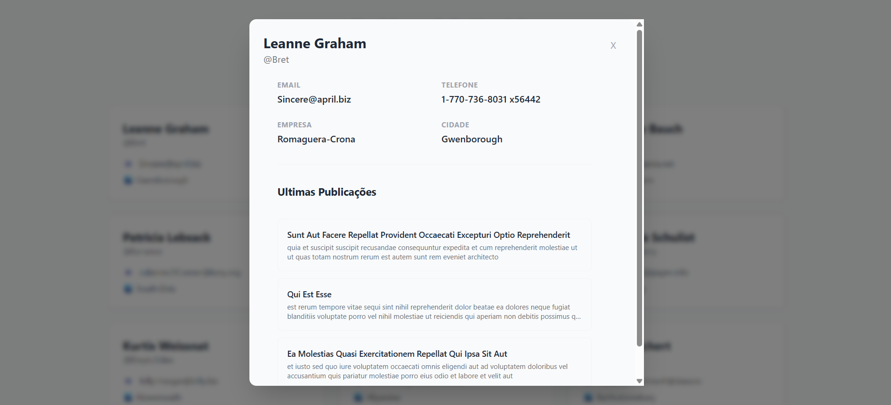

# 🚀 Dashboard de Usuários - Teste Desenvolvedor Júnior

Este projeto é uma aplicação web desenvolvida como parte do teste técnico para a vaga de Desenvolvedor Júnior. A aplicação consome uma API pública para exibir uma lista de usuários, permitindo filtragem e visualização detalhada de informações e postagens recentes.




## 🛠️ Tecnologias Utilizadas

* **React** (v19)
* **TypeScript** - Para tipagem estática e segurança do código.
* **Vite** - Build tool rápida e otimizada.
* **Tailwind CSS** - Para estilização responsiva e ágil.
* **Fetch API** - Para requisições HTTP nativas (sem dependências externas).

## ✨ Funcionalidades

* ✅ **Listagem de Usuários:** Exibição em Grid responsivo.
* ✅ **Busca Otimizada:** Filtro por nome com **Debounce** (atraso na digitação) para performance.
* ✅ **Detalhes (Modal):** Exibição de dados completos (Endereço, Empresa, Contato).
* ✅ **Extra (Posts):** Integração para buscar e listar as 3 últimas postagens do usuário selecionado.
* ✅ **Feedback Visual:** Estados de Carregamento (Skeleton/Spinner) e Tratamento de Erros.

## 📦 Como Rodar o Projeto

Pré-requisitos: Node.js instalado.

1. **Clone o repositório**
```bash
git clone git@github.com:rafaMI6/teste-motoca-frontend-jr.git
```

2. **Entre na pasta**
```bash
cd teste-motoca-frontend-jr
```

3. **Instale as dependências**
```bash
npm install
```

4. **Rode o servidor de desenvolvimento**
```bash
npm run dev
```

## 🧠 Decisões Técnicas

* **Arquitetura de Pastas:** O projeto foi organizado separando `components`, `services`, `hooks` e `types`. Isso garante que a lógica de API fique isolada da interface (UI), facilitando testes e manutenção futura.
* **Gerenciamento de Estado:** Utilizei o `useState` e `useEffect` do React. Para uma aplicação deste porte, o Context API ou Redux seriam um exagero.
* **Performance (Debounce):** Implementei um Custom Hook (useDebounce) para o campo de busca. Isso evita que a filtragem ocorra a cada tecla digitada, aguardando o usuário parar de digitar por 500ms. Essa prática melhora a performance e a experiência do usuário, simulando um cenário real de escalabilidade.
* **Loading/Error:** Foram implementados feedbacks visuais de carregamento e tratamento de erros para garantir que o usuário nunca fique vendo uma tela em branco.

## 🔮 Melhorias Futuras

Com mais tempo, eu implementaria:

* **Testes Automatizados:** Adicionar Vitest + React Testing Library para garantir a estabilidade dos componentes.
* **Paginação:** Implementar paginação na lista de usuários caso a API retornasse milhares de registros.
* **Virtualização:** Usar uma lista virtualizada para renderizar apenas os itens visíveis na tela, melhorando a performance em listas gigantes.
* **Dark Mode:** Adicionar suporte nativo ao modo escuro usando as classes do Tailwind.

---
Desenvolvido por Rafael Silva da Rocha